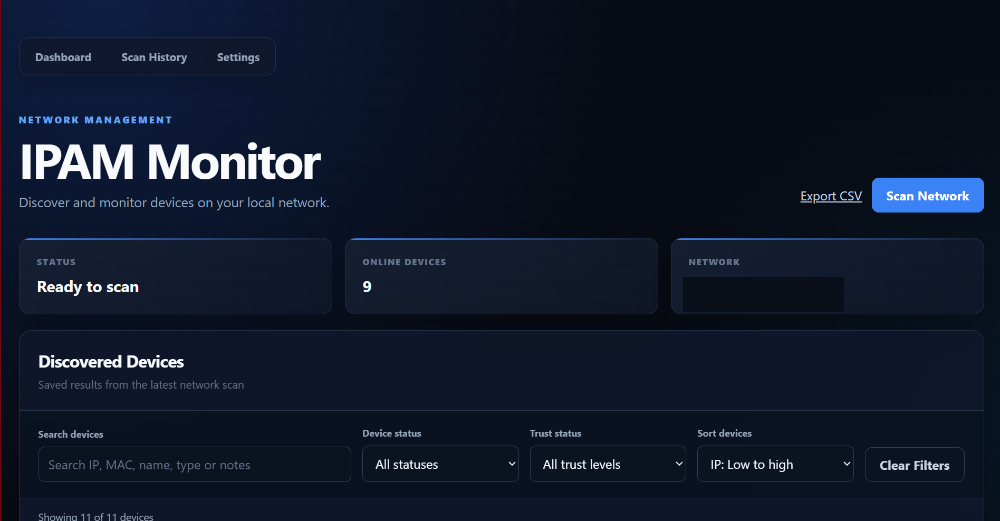
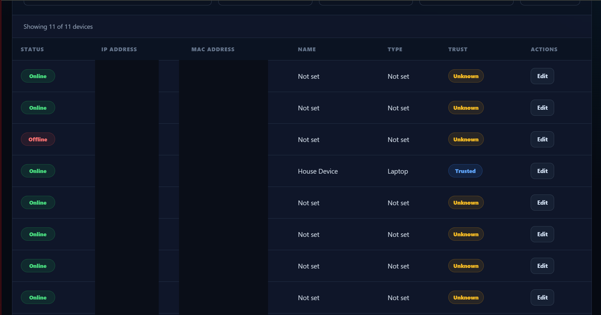
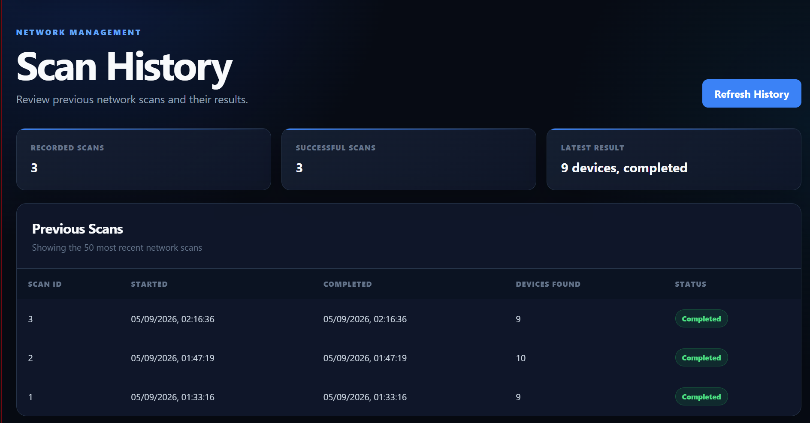
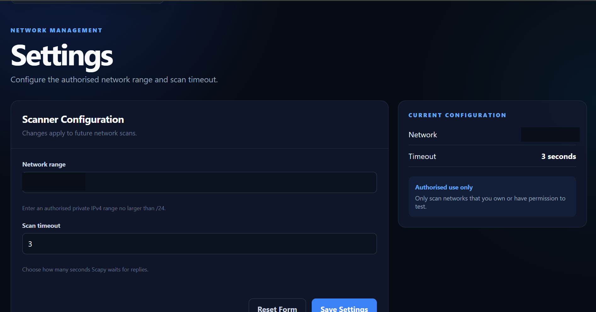

# IPAM Monitor

A lightweight IP Address Management (IPAM) and network device monitoring tool, built in Python and Flask.

## Background

This project was built after completing a short-term internship in network testing, where I worked with a commercial NAC/IPAM product. This tool re-implements the core concepts I encountered professionally — device discovery, IP range tracking, and status monitoring — as an original, self-initiated build from scratch.

## Features

- **Network scanning** — ARP-based device discovery across a configurable IP range
- **Device tracking** — persistent record of every device seen, with online/offline status, trust classification, and editable notes
- **Scan history** — a log of every scan run, including failures, with device counts
- **Settings** — configurable network range and scan timeout, editable through the UI
- **CSV export** — download the full device list
- **Search, filter, and sort** — find devices by IP, MAC, name, type, or notes; filter by status or trust level

## Screenshots

Real device IP and MAC addresses have been redacted from the images below to avoid exposing details of a private network.

## Security

Built with security as a first-class concern, not an afterthought — see [SECURITY.md](SECURITY.md) for the full list of implemented controls (input validation, parameterised queries, rate limiting, security headers, audit logging, and environment-based secrets).

## Tech stack

- **Backend:** Python, Flask
- **Network scanning:** Scapy (ARP requests)
- **Database:** SQLite
- **Frontend:** Vanilla HTML/CSS/JavaScript
- **Security:** Flask-Limiter, python-dotenv

## Setup

1. Clone the repo and `cd` into it
2. Create a virtual environment: `python -m venv venv`
3. Activate it: `venv\Scripts\activate` (Windows) or `source venv/bin/activate` (Mac/Linux)
4. Install dependencies: `pip install -r requirements.txt`
5. Create a `.env` file with a `SECRET_KEY` (see `.env.example`, or generate one with `python -c "import secrets; print(secrets.token_hex(32))"`)
6. Run: `python app.py`
7. Open `http://127.0.0.1:5000`

**Note:** Scapy requires admin/root privileges to send raw packets. Run your terminal as Administrator (Windows) or use `sudo` (Mac/Linux).

## Author

Connor Evans — Cyber Security and Digital Forensics student, UWE Bristol